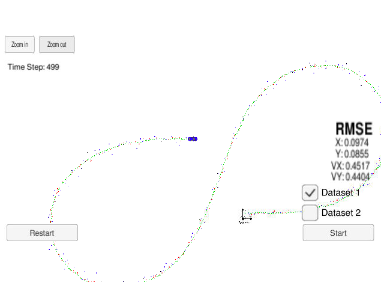
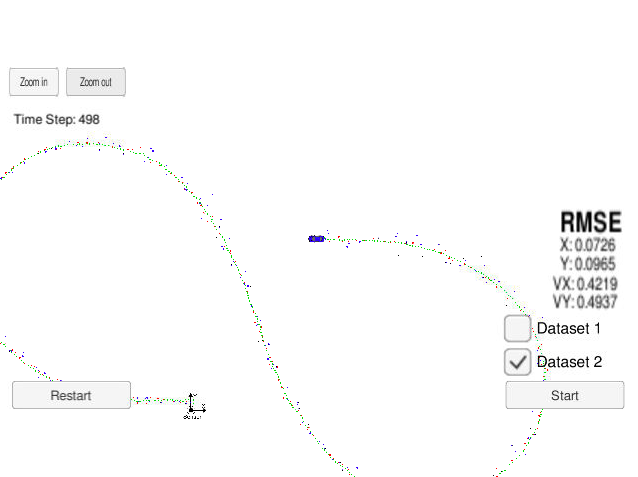

# Extended Kalman Filter Project Starter Code
Self-Driving Car Engineer Nanodegree Program

In this project you will utilize a kalman filter to estimate the state of a moving object of interest with noisy lidar and radar measurements. Passing the project requires obtaining RMSE values that are lower than the tolerance outlined in the project rubric. 

## Basic Build Instructions

1. Clone this repo.
2. Make a build directory: `mkdir build && cd build`
3. Compile: `cmake .. && make` 
   * On windows, you may need to run: `cmake .. -G "Unix Makefiles" && make`
4. Run it: `./ExtendedKF `

## Editor Settings

We've purpose fully kept editor configuration files out of this repo in order to
keep it as simple and environment agnostic as possible. However, we recommend
using the following settings:

* indent using spaces
* set tab width to 2 spaces (keeps the matrices in source code aligned)

# Project Instructions and Rubric

Note: regardless of the changes you make, your project must be buildable using
cmake and make!

More information is only accessible by people who are already enrolled in Term 2 (three-term version) or Term 1 (two-term version)
of CarND. If you are enrolled, see the Project Resources page in the classroom
for instructions and the project rubric.

## Compiling

Code can be complied without errors with cmake and make.
No change made in CMakeLists.txt.

## Accuracy

### RMSE must have [.11, .11, 0.52, 0.52] or less when using the file: "obj_pose-laser-radar-synthetic-input.txt" which is the same data file the simulator uses for Dataset 1.

The first code didn't satisfy the criteria. (Execution file is exe/ExtendedKF_float
Dataset 1 : RMSE <= [0.1403, 0.6668, 0.6051, 1.6270]
As you can see around the half way, the estimation path (green triangles) went very different direction.
I thought the accuracy of the Kalman filter parameters is not enough, because variables were defined as float to save memory space at first.
So, I changed them into `double`, however, the result was the same.

Then, I normalized theta of y data into [-pi, pi], so that the theta element of y won't be out of the range. (line 58-64 in src/kalman_filter.cpp).

Then, finally,  the mis-estimation was solved, and EKF accuracy achieved the target as below:

Dataset 1 : RMSE <= [0.0974, 0.0855, 0.4517, 0.4404]
Dataset 2 : RMSE <= [0.0726, 0.0965, 0.4219, 0.4937]

## Follows the Correct Algorithm

### Sensor Fusion algorithm follows the general processing flow as taught in the preceding lessons.

The Kalman filter implementation can be found src/kalman_filter.cpp, and sensor fusion algorithm is in src/FusionEKF.cpp.

### Kalman Filter algorithm handles the first measurements appropriately.

The first measurement is handled at src/FusionEKF.cpp from line 60 to line 105

### Kalman Filter algorithm first predicts then updates.

First, the algorithm predicts at line 107-145 in src/FusionEKF.cpp and then update operation from the measurements at line 156 - 166.

### Kalman Filter can handle radar and lidar measurements.

Different type of measurements are handled by looking at measurement_pack.sensor_type_ in src/FusionEKF.cpp.

## Code Efficiency

### Algorithm should avoid unnecessary calculations.

This calculation optimization example is Q matrix calculation in src/FusionEKF.cpp line 132 to 142.

