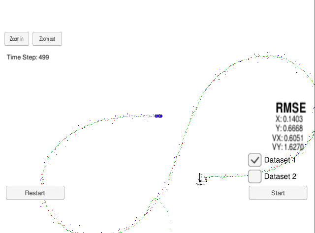

# Extended Kalman Filter Project Starter Code
Self-Driving Car Engineer Nanodegree Program

In this project you will utilize a kalman filter to estimate the state of a moving object of interest with noisy lidar and radar measurements. Passing the project requires obtaining RMSE values that are lower than the tolerance outlined in the project rubric. 

## Basic Build Instructions

1. Clone this repo.
2. Make a build directory: `mkdir build && cd build`
3. Compile: `cmake .. && make` 
   * On windows, you may need to run: `cmake .. -G "Unix Makefiles" && make`
4. Run it: `./ExtendedKF `

## Editor Settings

We've purpose fully kept editor configuration files out of this repo in order to
keep it as simple and environment agnostic as possible. However, we recommend
using the following settings:

* indent using spaces
* set tab width to 2 spaces (keeps the matrices in source code aligned)

## Project Instructions and Rubric

Note: regardless of the changes you make, your project must be buildable using
cmake and make!

More information is only accessible by people who are already enrolled in Term 2 (three-term version) or Term 1 (two-term version)
of CarND. If you are enrolled, see the Project Resources page in the classroom
for instructions and the project rubric.

## Compiling

Code can be complied without errors with cmake and make.
No change made in CMakeLists.txt.

## Accuracy

# RMSE must have [.11, .11, 0.52, 0.52] or less when using the file: "obj_pose-laser-radar-synthetic-input.txt" which is the same data file the simulator uses for Dataset 1.

The first code didn't satisfy the criteria.
Dataset 1 : RMSE <= [0.1403, 0.6668, 0.6051, 1.6270]

As you can see around the half way, the estimation path went very different direction.

The EKF accuracy was:

Dataset 1 : RMSE <= []
Dataset 2 : RMSE <= []

## Follows the Correct Algorithm

# Sensor Fusion algorithm follows the general processing flow as taught in the preceding lessons.

The Kalman filter implementation can be found src/kalman_filter.cpp and it is used to predict at src/FusionEKF.cpp line 147 and to update line 159 to 169.

# Kalman Filter algorithm handles the first measurements appropriately.

The first measurement is handled at src/FusionEKF.cpp from line 61 to line 107

# Kalman Filter algorithm first predicts then updates.

The predict operation could be found at src/FusionEKF.cpp line 147 and the update operation from line 159 to 169 of the same file.

# Kalman Filter can handle radar and lidar measurements.

Different type of measurements are handled in two places in src/FusionEKF.cpp:

* For the first measurement from line 61 to line 107.
* For the update part from line 159 to 169.

## Code Efficiency

# Algorithm should avoid unnecessary calculations.

This calculation optimization example is Q matrix calculation in src/FusionEKF.cpp line 132 to 142.

